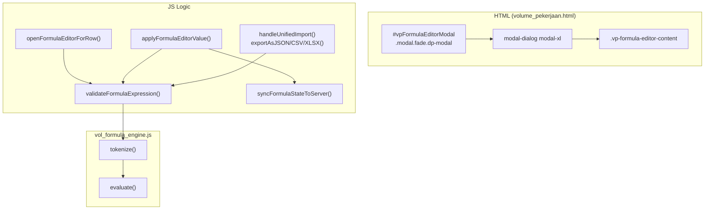

# Audit Komprehensif: Formula Editor Modal (v2 — Expanded)

> **Tanggal Audit:** 13 Februari 2026  
> **Cakupan:** HTML, CSS, JS, Backend, UI/UX, Error Handling, **Export/Import, Security, Performance, Accessibility, Testing**  
> **File Utama:**
> - volume_pekerjaan.html — Lines 500-579
> - volume_pekerjaan.css — Lines 720-888, 1987-1990
> - volume_pekerjaan.js — 6074 baris (~80 fungsi formula-related, ~328 total outline items)
> - vol_formula_engine.js — 382 baris (tokenizer + evaluator)
> - views.py — `volume_pekerjaan_view` (L43-60)
> - views_api.py — API endpoints formula/parameter

---

## 1. Arsitektur Komponen

---

## 2. Temuan Per Kategori (Asli)

### 2.1 HTML — Struktur Modal

| # | Temuan | Severity | Status |
|---|--------|----------|--------|
| H1 | Modal ditempatkan **dalam** `` → di-render di dalam `<main id="main-content">`. **Hipotesis:** Jika parent membuat stacking context baru (transform/filter/will-change), z-index modal tidak bisa melampaui elemen luar. **Belum terkonfirmasi** — dari audit CSS tidak ditemukan property yang membuat stacking context pada `#main-content`. Perlu di-reproduksi secara manual. | 🟡 Hipotesis | **Perlu reproduksi** |
| H2 | Tidak ada `data-bs-backdrop="static"` — modal bisa ditutup dengan klik di luar saat mengedit. Draft ter-persist ke localStorage secara otomatis (380ms debounce), sehingga **risiko data loss rendah** tapi UX bisa membingungkan. | 🟡 Medium | Terbuka |
| H3 | `tabindex="-1"` pada modal container sudah benar (Bootstrap standard). | ✅ OK | — |
| H4 | Tombol "Batal" dan "×" menggunakan `data-bs-dismiss="modal"` — **tidak ada konfirmasi** jika perubahan belum disimpan. | 🟡 Medium | Terbuka |
| H5 | `aria-labelledby="vpFormulaEditorLabel"` → terhubung `<h5 id="vpFormulaEditorLabel">`. | ✅ OK | — |
| H6 | `spellcheck="false"` pada textarea. | ✅ OK | — |
| H7 | `aria-live="polite"` pada chip preview dan block error. | ✅ OK | — |

---

### 2.2 CSS — Styling & Layout

| # | Temuan | Severity | Status |
|---|--------|----------|--------|
| C1 | **z-index `#vpFormulaEditorModal`: 13050** — di atas Topbar (12044). Efektif selama **tidak ada** stacking context trap (lihat H1 — belum terkonfirmasi). | ✅ OK (probably) | — |
| C2 | Modal dialog `max-width: min(96vw, 1200px)` — responsif. | ✅ OK | — |
| C3 | Content `min-height: min(80vh, 820px)` — ruang cukup. | ✅ OK | — |
| C4 | Highlight layer `z-index: 2` (visual overlay) + `pointer-events: none`, textarea `z-index: 1` (interaktif). **Benar** — highlight meng-overlay tanpa blocking input. | ✅ OK | — |
| C5 | `color-mix()` — tidak didukung browser lama (Safari < 16.4). | 🟢 Low | — |
| C6 | Dark mode: bergantung token global, belum diverifikasi visual. | 🟡 Medium | Terbuka |

---

### 2.3 JavaScript — Logika Inti

#### 2.3.1 Inisialisasi & Event Binding

| # | Temuan | Severity | Status |
|---|--------|----------|--------|
| J1 | `installFormulaEditorEvents()` — guard `dataset.boundEditor` mencegah duplikat bind. | ✅ OK | — |
| J2 | Debounce 80ms (preview) + 380ms (draft) — cukup responsif. | ✅ OK | — |
| J3 | Blur event (L3503): `isFormulaMode(id, input.value)` → **juga** mengecek `fxModeById[id]` (L3614-3617), sehingga mask state **TIDAK** dihapus selama fxMode aktif. | ✅ OK | — |
| J4 | `hideSuggest` delay 120ms pada blur. Bisa terlalu pendek untuk device lambat (200ms disarankan). | 🟢 Low | — |

#### 2.3.2 Label Mask State Safety

| # | Temuan | Severity | Status |
|---|--------|----------|--------|
| J5 | `getInputFormulaRaw()` (L1019-1025): jika mask state hilang, **memprioritaskan** `fallback` parameter (biasanya `rawInputById[id]`), bukan `inputEl.value`. Hanya jika fallback juga kosong baru menggunakan `inputEl.value`. | ✅ OK | — |
| J6 | `rawInputById[id]` di-update di `handleInputChange` (L3487) — menggunakan `liveRaw` yang berasal dari `getInputFormulaRaw(input, rawInputById[id])`. Karena fallback prioritas ada pada `rawInputById[id]`, **circular fallback aman** selama `rawInputById` pernah di-set dengan raw code yang benar (saat prefill/open editor). | ✅ OK (umumnya) | — |
| J7 | **Edge case potensial:** Jika `fxModeById[id]` belum di-set **DAN** `rawInputById[id]` kosong **DAN** user mengetik label text langsung — bisa terjadi label leak. Ini **sangat jarang** karena fxMode di-set saat `=` terdeteksi. Severity diturunkan. | 🟢 Low | **Edge case** |

#### 2.3.3 Open / Apply / Close

| # | Temuan | Severity | Status |
|---|--------|----------|--------|
| J8 | `openFormulaEditorForRow()` — memulihkan draft jika lebih baru. | ✅ OK | — |
| J9 | `applyFormulaEditorValue()` — blocking error mencegah submit. | ✅ OK | — |
| J10 | `hidden.bs.modal` — cleanup menyeluruh. | ✅ OK | — |
| J11 | Tidak ada "unsaved changes" warning. Draft ter-persist otomatis. | 🟡 Medium | Terbuka |

#### 2.3.4 Validasi Formula

| # | Temuan | Severity | Status |
|---|--------|----------|--------|
| J12 | Pipeline komprehensif: tokenize → cek whitelist → cek scope → evaluate. | ✅ OK | — |
| J13 | Whitelist 9 fungsi: sum, min, max, round, avg, abs, floor, ceil, pow. | ✅ OK | — |
| J14 | Invalid token overlay dengan highlight merah. | ✅ OK | — |
| J15 | Engine `VolFormula` synchronous dan deterministik. | ✅ OK | — |
| J16 | Negative clamping + user notification. | ✅ OK | — |
| J17 | **Tidak ada validasi server-side** untuk formula expression. | 🔴 Critical | Terbuka |

#### 2.3.5 Sync & Persistence

| # | Temuan | Severity | Status |
|---|--------|----------|--------|
| J18 | Conflict detection via HTTP 409 + `last_sync_at`. | ✅ OK | — |
| J19 | `formulaSyncInFlight` guard mencegah concurrent requests. | ✅ OK | — |
| J20 | Autosave 30s + localStorage 380ms. | ✅ OK | — |
| J21 | Tidak ada retry logic pada network error. | 🟡 Medium | Terbuka |

---

### 2.4 Backend — View & API

| # | Temuan | Severity | Status |
|---|--------|----------|--------|
| B1 | `volume_pekerjaan_view()` — `select_related` optimal. | ✅ OK | — |
| B2 | Feature flags via settings (`opaque_id_enabled`, `formula_label_only_ui_enabled`). | ✅ OK | — |
| B3 | `_is_stale_sync()` + `_parse_sync_timestamp()` — conflict detection. | ✅ OK | — |
| B4 | Parameter regex validation server-side (`_BASE_PARAM_NAME_RE`). | ✅ OK | — |
| B5 | **Tidak ada sanitasi formula `raw`** — diterima apa adanya. | 🔴 Critical | Terbuka |

---

### 2.5 UI/UX — Pengalaman Pengguna

| # | Temuan | Severity | Status |
|---|--------|----------|--------|
| U1 | Dual view mode (raw + chip) ✅ | ✅ OK | — |
| U2 | Inline value toggle ✅ | ✅ OK | — |
| U3 | Keyboard shortcuts (Ctrl+Space, Ctrl+Enter, Ctrl+Shift+Z) ✅ | ✅ OK | — |
| U4 | Parameter Palette dengan search filter ✅ | ✅ OK | — |
| U5 | Resolver mechanism — error recovery UX ✅ | ✅ OK | — |
| U6 | Undo terbatas 1 level per baris. | 🟡 Medium | Terbuka |
| U7 | Tidak ada loading indicator saat sync. | 🟡 Medium | Terbuka |

---

### 2.6 Error Handling

| # | Temuan | Severity | Status |
|---|--------|----------|--------|
| E1 | try-catch pada tokenize/evaluate → `humanizeFormulaError()`. | ✅ OK | — |
| E2 | Opaque code → label translation di error messages. | ✅ OK | — |
| E3 | VolFormula fallback jika engine tidak tersedia. | ✅ OK | — |
| E4 | Blocking state → disable tombol "Terapkan". | ✅ OK | — |
| E5 | Sync error handling: network/conflict/validation. | ✅ OK | — |
| E6 | Tidak ada error boundary global di event handlers. | 🟡 Medium | Terbuka |

---

## 3. Kategori Audit Baru

### 3.1 Export/Import

**File:** volume_pekerjaan.js L4446-4797

#### Arsitektur

| Fungsi | Format | Arah | Lines |
|--------|--------|------|-------|
| `exportAsJSON()` | JSON | Export | 4501-4514 |
| `exportAsCSV()` | CSV | Export | 4516-4527 |
| `exportAsXLSX()` | XLSX | Export | 4529-4545 |
| `copyJSONToClipboard()` | JSON | Clipboard | 4547-4560 |
| `parseJSONToVarsLabels()` | JSON | Import | 4592-4629 |
| `parseCSVToVarsLabels()` | CSV | Import | 4631-4657 |
| `parseXLSXToVarsLabels()` | XLSX | Import | 4659-4695 |
| `handleUnifiedImport()` | * | Import | 4697-4749 |

#### Temuan

| # | Temuan | Severity | Status |
|---|--------|----------|--------|
| IO1 | **Export menggunakan `variables` map** (raw opaque codes, bukan label text). Ini berarti export TIDAK terpengaruh label leak — **round-trip aman**. | ✅ OK | — |
| IO2 | **Import memvalidasi** parameter code via `isValidBaseParamCode()` — hanya `bp_N` format yang diterima. Invalid codes di-skip dengan error message per baris. | ✅ OK | — |
| IO3 | **Merge vs Replace strategy** — user diberi pilihan via `confirmModal()`. Merge: `{ ...existing, ...imported }`. Replace: `{ ...imported }`. | ✅ OK | — |
| IO4 | CSV sanitasi output: `safeCode.replace(/[\r\n,]/g, ' ')` — mencegah CSV injection dasar. | ✅ OK | — |
| IO5 | CSV parsing menerima separator `,;\\t` — fleksibel tapi bisa ambiguous jika label mengandung semicolon. | 🟢 Low | — |
| IO6 | XLSX import **tidak memvalidasi file size** — file besar bisa menyebabkan browser hang karena `file.arrayBuffer()` + SheetJS parsing dilakukan di main thread. | 🟡 Medium | Terbuka |
| IO7 | XLSX export **fallback ke CSV** jika SheetJS tidak tersedia — graceful degradation. | ✅ OK | — |
| IO8 | Error reporting pada import: max 10 errors ditampilkan via `alertModal()` — cukup informatif. | ✅ OK | — |
| IO9 | **Computed parameters (`cp_N`)** tidak di-export/import. Hanya base parameters (`bp_N`). Bisa menyebabkan formula yang mereferensikan computed param menjadi invalid setelah import/replace. | 🟡 Medium | Terbuka |
| IO10 | `parseCSV()` header detection: regex `/^(kode|code|nama|label)$/` — sudah handle bahasa Indonesia dan Inggris. | ✅ OK | — |
| IO11 | Setelah import, `reevaluateAllFormulas()` dipanggil — memastikan preview dan state terupdate. | ✅ OK | — |
| IO12 | **Tidak ada undo** setelah import/replace. Jika user salah pilih "Replace", semua parameter lama hilang tanpa cara recovery selain reload. | 🟡 Medium | Terbuka |

---

### 3.2 Security

| # | Temuan | Severity | Status |
|---|--------|----------|--------|
| S1 | **CSRF token**: `getCsrf()` (L497) membaca dari cookie `csrftoken`, dikirim via header `X-CSRFToken` (L355) pada semua POST requests (`HTTP.jpost`). **Benar dan konsisten** dengan pattern Django. | ✅ OK | — |
| S2 | **`innerHTML` DIGUNAKAN** di beberapa callsite: toast builder (L323), search dropdown (L798), `renderVarTable()` (L4015), `renderComputedTable()` (L4188), `showExportMenu()` (L4567). Namun, jalur yang menerima user input **sudah dilindungi** `escapeHtml()` — contoh: L4017 (`escapeHtml(label)`), L4190 (`escapeHtml(label)`), L4194 (`escapeHtml(expression)`), L325 (`escapeHtml(message)`). `showExportMenu()` hanya menggunakan string statis. **Risiko XSS rendah** selama pattern `escapeHtml` dipertahankan. | ✅ OK (dengan catatan) | — |
| S3 | **Gap governance keamanan XSS:** walau callsite utama sudah memakai `escapeHtml()` (S2), belum ada guard otomatis (lint/test rule) untuk mencegah callsite `innerHTML` baru tanpa escaping saat refactor fitur berikutnya. | 🟡 Medium | Terbuka |
| S4 | **Formula engine sandboxed**: `vol_formula_engine.js` TIDAK menggunakan `eval()`, `Function()`, atau akses ke `window`. Evaluasi dilakukan via tokenizer + shunting-yard + RPN stack. **Aman dari code injection.** | ✅ OK | — |
| S5 | **JSON.parse pada import** — standard, tidak rawan injection karena JSON.parse tidak menjalankan kode. | ✅ OK | — |
| S6 | **localStorage poisoning**: `formulaDraftById` dan `varLabels` disimpan di localStorage. User yang memanipulasi localStorage bisa menyuntikkan label/value arbitrary. Karena formula engine **sandboxed** (S4) dan callsite `innerHTML` yang menerima label **sudah memakai `escapeHtml()`** (S2), **dampak terbatas** — hanya bisa mengubah display text. Namun, jika ada callsite baru yang lupa `escapeHtml`, risiko naik. | 🟢 Low | — |
| S7 | **File upload pada import**: accept attribute di-set ke `.json,.csv,.xlsx`. Tidak ada validasi file size server-side (import hanya client-side). **Risiko DoS** jika file sangat besar. | 🟡 Medium | Terbuka |
| S8 | **Server-side formula validation (MASIH TIDAK ADA)** — `raw` formula string diterima tanpa sanitasi. Jika di-evaluate di backend → injection risk. | 🔴 Critical | Terbuka |

---

### 3.3 Performance

| # | Temuan | Severity | Status |
|---|--------|----------|--------|
| P1 | **`reevaluateAllFormulas()`** (L3935-3945) — iterates semua rows (`document.querySelectorAll('tr[data-pekerjaan-id]')`) dan memanggil `handleInputChange` per row. Pada project dengan 500+ baris, ini bisa menyebabkan **jank** karena semua evaluasi dilakukan synchronously di main thread. | 🟡 Medium | Terbuka |
| P2 | **`renderFormulaEditorInvalidOverlay()`** (L2849-2872) — rebuilds innerHTML setiap kali formula berubah. Pada formula panjang dengan banyak token, ini bisa berat. Mitigasi: debounce 80ms pada preview (J2). | 🟢 Low | — |
| P3 | **Memory: `rawInputById`, `formulaDraftById`, `varLabels`, `variables`** — Maps/Objects yang bertahan sepanjang session. Tidak ada cleanup saat project diganti (single-page aplikasi tidak reload). Namun, page ini di-load ulang saat pindah project (Django template rendering), sehingga **risiko rendah**. | ✅ OK | — |
| P4 | **XLSX import di main thread** — `file.arrayBuffer()` + SheetJS parsing bisa blocking UI untuk file besar. Web Worker disarankan. | 🟡 Medium | Terbuka |
| P5 | **`collectFormulaSyncItems()`** — iterates rows untuk mengumpulkan dirty items. Dengan 500+ baris, traversal DOM cukup ringan karena hanya membaca `dataset` attributes. | ✅ OK | — |
| P6 | **`buildSearchIndex()`** — builds search index untuk seluruh tabel. Dipanggil sekali saat prefill. | ✅ OK | — |
| P7 | **Tokenizer** (`vol_formula_engine.js`) — O(n) character-by-character scan. Cukup efisien untuk formula pendek (~50 chars). Untuk formula 500+ chars, masih sub-millisecond. | ✅ OK | — |

---

### 3.4 Accessibility (a11y)

| # | Temuan | Severity | Status |
|---|--------|----------|--------|
| A1 | **ARIA attributes**: `aria-labelledby`, `aria-live="polite"`, `role="status"` pada elemen kunci — standar baik. | ✅ OK | — |
| A2 | **Keyboard: `Ctrl+Space`** (suggest), **`Ctrl+Enter`** (apply), **`Ctrl+Shift+Z`** (undo), **`Alt+Enter`** (open editor), **`Escape`** (close suggest). Shortcuts ditampilkan di UI. | ✅ OK | — |
| A3 | **`inputmode` toggle**: `setQtyInputInteractionMode()` (L2623-2633) mengatur `inputmode="text"` untuk formula dan `inputmode="decimal"` untuk angka — **mobile keyboard optimization**. | ✅ OK | — |
| A4 | **Focus management**: setelah modal open → textarea focus (80ms delay). Setelah apply → focus kembali ke inline input. `hidden.bs.modal` → restores focus context. | ✅ OK | — |
| A5 | **Focus trap di modal**: Bootstrap 5 secara default **sudah** menghandle focus trap pada `.modal`. | ✅ OK | — |
| A6 | **Color contrast pada chip**: chip menggunakan `color-mix()` dengan background opacity rendah. **Perlu verifikasi** apakah memenuhi WCAG AA (contrast ratio ≥ 4.5:1 untuk teks kecil). | 🟡 Medium | Perlu verifikasi |
| A7 | **Suggestion dropdown** (`suggestState`) — navigasi ArrowUp/ArrowDown + Enter/Tab untuk apply. **Benar**. | ✅ OK | — |
| A8 | **Error announcements**: `aria-live="polite"` pada `#vp-fe-block` mengumumkan error ke screen reader. Namun, inline validation errors pada qty input **tidak** memiliki `aria-live` — screen reader mungkin tidak mengumumkannya. | 🟡 Medium | Terbuka |
| A9 | **ARIA toast masih belum konsisten**: action-toast memakai `role="alert"` (assertive), namun fallback/single toast memakai `role="status"`. Perlu standardisasi perilaku announcement agar konsisten lintas tipe toast. | 🟡 Medium | Terbuka |

---

### 3.5 Testing Coverage

**File test relevan:** `detail_project/tests_formula_ui_regressions.py` (90 baris, 8 test cases)

#### Test Coverage Map

| Test Case | Apa yang diuji | Jenis |
|-----------|----------------|-------|
| `test_cursor_mapping_keeps_token_end_boundary` | Cursor mapping di mask state | Source-grep guard |
| `test_autosave_block_does_not_force_focus` | Focus suppression saat autosave | Source-grep guard |
| `test_formula_state_snapshot_has_server_fallback_when_local_empty` | Server fallback saat localStorage kosong | Source-grep guard |
| `test_programmatic_focus_guard_exists` | Guard programmatic focus | Source-grep guard |
| `test_editor_block_state_disables_apply_button` | Block state → disable apply | Source-grep guard |
| `test_formula_mode_toggles_inputmode_for_mobile_keyboard` | inputmode toggle (a11y) | Source-grep guard |
| `test_fill_down_copies_raw_and_fx_state` | Fill-down preserves raw + fx state | Source-grep guard |
| `test_tutorial_link_is_not_empty` | Tutorial link exists in template | Source-grep guard |

#### Temuan Testing

| # | Temuan | Severity | Status |
|---|--------|----------|--------|
| T1 | **Semua 8 tests adalah "source-grep guards"** — mereka hanya mengecek apakah string tertentu **ada** di source code (via `assertIn`). Ini **bukan** unit/integration tests — mereka tidak menjalankan kode JS atau memvalidasi behavior. Fungsinya **mencegah regresi** jika kode penting terhapus saat refactoring. | 🟡 Medium — design choice | — |
| T2 | **Tidak ada unit test untuk `vol_formula_engine.js`** — tokenizer dan evaluator tidak diuji secara langsung. Edge cases seperti formula kosong, hanya "=", division by zero, nested parentheses, tidak tercakup. | 🟡 Medium | Terbuka |
| T3 | **Tidak ada integration test** untuk siklus end-to-end: create formula → validate → save → sync → reload → verify persisted state. | 🟡 Medium | Terbuka |
| T4 | **Tidak ada browser/E2E test** (Playwright/Cypress/Selenium) untuk interaksi Formula Editor — modal open, input, preview, apply, close. | 🟡 Medium | Terbuka |
| T5 | **Backend API tests** — `tests_phase1_opaque_api.py` **sudah mengcover formula state API**: `test_formula_state_get_returns_updated_at_and_synced_at` (L182) menguji GET, `test_formula_state_post_returns_409_when_last_sync_is_stale` (L204) menguji conflict detection POST 409. | ✅ OK | — |
| T6 | **Import/export** — tidak ada test untuk round-trip (export → import → compare). | 🟡 Medium | Terbuka |

---

## 4. Z-Index Map

| Layer | Elemen | Z-Index | Status |
|-------|--------|---------|--------|
| Toast | `.dp-layer-toast` | **13100** | ✅ |
| Editor Modal | `#vpFormulaEditorModal` | **13050** | ✅ |
| Help Modal | `#vpFormulaHelpModal` | **1060** | ⚠️ Perlu **13060** |
| Modal (global) | `.modal` | **13000** | ✅ |
| Backdrop | `.modal-backdrop` | **12990** | ✅ |
| Topbar | `#dp-topbar` | **12044** | ✅ |
| FAB | `.vp-fab-container` | **1030** | ⚠️ Perlu **12032** |

> **CAUTION:** `#vpFormulaHelpModal` (z-index 1060) dan `.vp-fab-container` (z-index 1030) masih di bawah Topbar. Perlu diupdate.

---

## 5. Ringkasan Status Lengkap

| Kategori | ✅ OK | 🟡 Medium | 🔴 Critical | 🟢 Low | Total |
|----------|-------|-----------|-------------|--------|-------|
| HTML | 5 | 2 | 0* | 0 | 7 |
| CSS | 4 | 1 | 0 | 1 | 6 |
| JS Core | 12 | 2 | 1 | 1 | 16 |
| JS Sync | 3 | 1 | 0 | 0 | 4 |
| Backend | 4 | 0 | 1 | 0 | 5 |
| UI/UX | 5 | 2 | 0 | 0 | 7 |
| Error Handling | 5 | 1 | 0 | 0 | 6 |
| **Export/Import** | **8** | **3** | **0** | **1** | **12** |
| **Security** | **4** | **2** | **1** | **1** | **8** |
| **Performance** | **4** | **2** | **0** | **1** | **7** |
| **Accessibility** | **5** | **3** | **0** | **0** | **8** |
| **Testing** | **1** | **5** | **0** | **0** | **6** |
| **Total** | **60** | **24** | **3** | **5** | **92** |

*\*H1 "stacking context trap" direklasifikasi dari Critical ke Hipotesis/Medium setelah review — tidak ditemukan CSS property penyebab pada `#main-content`.*

---

## 6. Rekomendasi Berprioritisasi

### 🔴 Critical (Harus segera)

| # | Item | Ref |
|---|------|-----|
| R1 | **Validasi server-side formula `raw`** — whitelist karakter + length limit | J17, B5, S8 |

### 🟡 High Priority

| # | Item | Ref |
|---|------|-----|
| R2 | Unit test untuk `vol_formula_engine.js` (tokenizer, evaluator, edge cases) | T2 |
| R3 | Tambahkan guard otomatis (lint/test rule) untuk mewajibkan escaping pada callsite `innerHTML` baru yang menyentuh data dinamis | S3 |
| R4 | Import file size limit / Web Worker untuk XLSX | IO6, P4 |
| R5 | Fix z-index `#vpFormulaHelpModal` → 13060 dan `.vp-fab-container` → 12032 | Z-Index Map |
| R6 | Color contrast verification pada chip (WCAG AA) | A6 |

### 🟡 Medium Priority

| # | Item | Ref |
|---|------|-----|
| R7 | Unsaved changes warning saat close modal | H2, H4, J11 |
| R8 | Import undo / snapshot sebelum replace | IO12 |
| R9 | Computed params inclusion in export/import | IO9 |
| R10 | `reevaluateAllFormulas()` batching / requestAnimationFrame | P1 |
| R11 | `aria-live` pada inline validation errors | A8 |
| R12 | Retry logic pada network error | J21 |
| R13 | Integration/E2E tests untuk formula lifecycle | T3, T4 |

### 🟢 Low Priority

| # | Item | Ref |
|---|------|-----|
| R14 | `color-mix()` CSS fallback | C5 |
| R15 | `hideSuggest` delay 120ms → 200ms | J4 |
| R16 | Dark mode visual verification | C6 |

---

## 7. Revisi dari Audit v1

| Poin v1 | Revisi v2 | Alasan |
|---------|-----------|--------|
| H1 "Stacking context trap" = 🔴 Critical confirmed | → 🟡 **Hipotesis**, perlu reproduksi | Dari audit CSS tidak ditemukan `transform`, `filter`, `will-change` pada `#main-content`. Belum ada bukti pasti. |
| "Label leak bug aktif" = 🔴 Critical | → 🟢 **Low edge case** | `isFormulaMode()` (L3614) mengecek `fxModeById[id]` **terlebih dahulu**, sehingga blur handler tidak menghapus mask state selama fxMode aktif. `getInputFormulaRaw()` juga memprioritaskan `rawInputById[id]` sebagai fallback. |
| `getInputFormulaRaw` langsung pakai display text | → **Tidak benar** — fungsi memprioritaskan `state.raw`, lalu `fallback` param, lalu `inputEl.value` sebagai last resort | Urutan fallback: mask state → rawInputById → inputEl.value. Dua layer pertama sudah mengandung raw code. |

---

## Kesimpulan

Komponen formula editor **well-engineered** dengan 60 dari 92 item dinilai OK (65%). Tiga area dengan gap terbesar:
1. **Testing** — 1 OK dari 6 (sebagian besar tests masih "regression guards", bukan behavior tests)
2. **Security** — server-side formula validation masih belum ada
3. **Accessibility** — perlu verifikasi color contrast dan ARIA coverage pada error states

Komponen yang paling robust: **Error Handling** (5/6 OK) dan **Export/Import** (8/12 OK dengan arsitektur export yang aman dari label leak).

