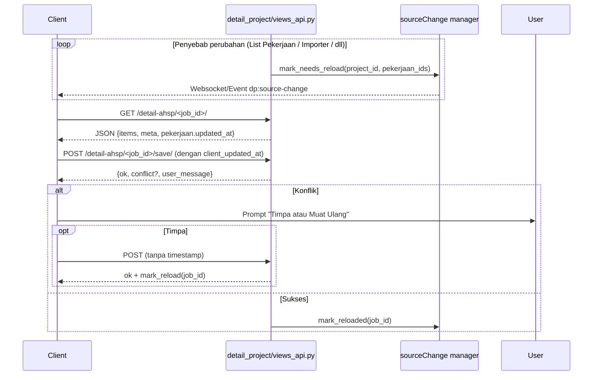

# Panduan Reload Template AHSP

Dokumen ini menjelaskan **apa** yang memicu status “Perlu Reload”, **kapan** sinyal itu dikirim, serta **bagaimana** dampaknya terhadap halaman lain (Harga Item & Rincian AHSP). Referensi ini dimaksudkan untuk developer yang harus menelusuri end-to-end workflow reload di sisi client dan server.

---

## 1. Sumber Data yang Memicu Reload

| Halaman / Proses | Aksi Pengguna / Sistem | Dampak ke Template AHSP |
| --- | --- | --- |
| **List Pekerjaan** | Menambah/menghapus pekerjaan, memindahkan klas/sub, mengganti kode/sumber (ref → custom atau sebaliknya) | Struktur pekerjaan berubah → `sourceChange` menandai ID pekerjaan sebagai *stale* |
| **Template AHSP** | Setelah pengguna menyimpan detail, cache lokal dihapus dan reload silent dijalankan | Status “Perlu reload” bersih untuk pekerjaan aktif, tetapi pekerjaan lain tetap mengikuti flag pusat |
| **Rekap RAB / Workflow Dashboard** | Reset template, sinkronisasi massal, atau impor data eksternal | Semua pekerjaan yang terkena perubahan diberi flag reload via event broadcast |
| **Halaman Referensi / Importer** | Perubahan AHSP referensi (mis. impor CSV, edit manual di referensi) | Semua pekerjaan yang memakai referensi itu menerima flag reload agar mendapat tarif terbaru |
| **API/Worker Back-end** | Script konsolidasi atau cleanup yang memodifikasi detail pekerjaan langsung di DB | Sistem manajemen status mem-publish event `dp:source-change` agar client mengetahui perubahan tanpa reload seluruh halaman |

---

## 2. Alur Client vs Server

### Client-side (Template AHSP)

```mermaid
flowchart TD
  SC[sourceChange event (dp:source-change)] -->|berisi daftar jobId| ST[Set pendingReloadJobs]
  ST --> UB[Update badge "Perlu reload" & banner]
  UserSelect[User memilih pekerjaan] --> Check{Job stale?}
  Check -- tidak --> Paint[Render dari cache]
  Check -- ya --> ReloadBtn[User klik "Muat ulang" atau banner]
  ReloadBtn --> RJ[reloadJobs helper]
  RJ --> SI[selectJobInternal(forceRefresh=true)]
  SI --> FetchAPI
  FetchAPI --> PaintFresh[Render hasil baru + clear flag]
  PaintFresh --> UB
```

### Server-side



Catatan:
- `Manager` mewakili lapisan `DP.sourceChange` yang menyimpan state pending reload per proyek.
- Even tanpa websocket, Template AHSP menanyakan state ini lewat AJAX ketika pengguna membuka halaman.

---

## 3. Alur Hingga “Timpa” Berhasil

1. **User edit detail** → klik `Simpan`.
2. Request membawa `client_updated_at` dari data terakhir yang dibaca.
3. Server membandingkan timestamp (optimistic locking). Jika berbeda, respons `conflict=true`.
4. Frontend menunjukkan modal (atau fallback `confirm`) untuk memilih:
   - **Timpa (overwrite)** → kirim ulang payload tanpa timestamp → server menimpa data terbaru.
   - **Muat ulang data terbaru** → reload halaman agar pengguna bekerja dengan versi paling baru.
5. Setelah sukses, frontend:
   - Menandai pekerjaan sebagai bersih (`pendingReloadJobs` dikurangi).
   - Men-trigger `reloadJobs([...], { silent:true, queue:true })` agar tampilan langsung sinkron.

---

## 4. Dampak ke Halaman Lain

### Harga Item Page
- Banyak tombol “Gunakan Template” atau “Sinkron dengan Template” mengambil data dari endpoint yang sama.
- Ketika Template AHSP reload, harga item otomatis membaca nilai terbaru karena setiap klik “Gunakan” memanggil API langsung (tidak mengandalkan cache).
- **Implikasi**: jika pekerjaan masih “Perlu reload”, harga item bisa menampilkan harga lama. Tekan reload di Template AHSP sebelum menyalin ke harga item agar konsisten.

### Rincian AHSP Page
- Halaman ini menampilkan breakdown akhir (setelah faset volume dan template).  
- Jika Template AHSP belum direload, Rincian AHSP mendeteksi mismatch dan memunculkan alert `volumeAlertEl` / snackbar agar pengguna memuat ulang pekerjaan di Template terlebih dahulu.
- Setelah Template melakukan reload massal, Rincian AHSP harus direfresh atau memanggil endpoint `/rekap` lagi untuk mengambil versi terbaru.
- **Optimasi yang sudah berjalan**: ketika user membuka Rincian AHSP dan backend mendeteksi flag reload belum dibersihkan, server mengembalikan status “perlu refresh” sehingga front-end menampilkan tombol “Muat ulang data” sebelum menampilkan list kosong.

---

## 5. Checklist Implementasi

1. **Sisipkan DP.sourceChange** di halaman apa pun yang bisa mengubah pekerjaan.
2. **Panggil** `sourceChange.mark_needs_reload(project_id, job_ids)` setiap kali ada perubahan struktural.
3. **Di Template AHSP**:
   - `pendingReloadJobs` diinisialisasi dari `sourceChange.listReloadJobs(projectId)`.
   - Banner + badge diperbarui setiap event `dp:source-change`.
   - `reloadJobs` dipanggil baik oleh UI (banner/overlay) maupun secara silent setelah `POST /save/`.
4. **Halaman lanjutan (Harga Item, Rincian AHSP)** harus:
   - Menampilkan indikator jika pekerjaan masih stale.
   - Menawarkan tombol menuju Template AHSP untuk reload.
   - Setelah reload selesai, panggil ulang API masing-masing untuk memastikan data sinkron.

Dengan mengikuti panduan ini, developer dapat dengan cepat menelusuri penyebab status “Perlu reload” dan memahami efek berantai pada halaman lain.
