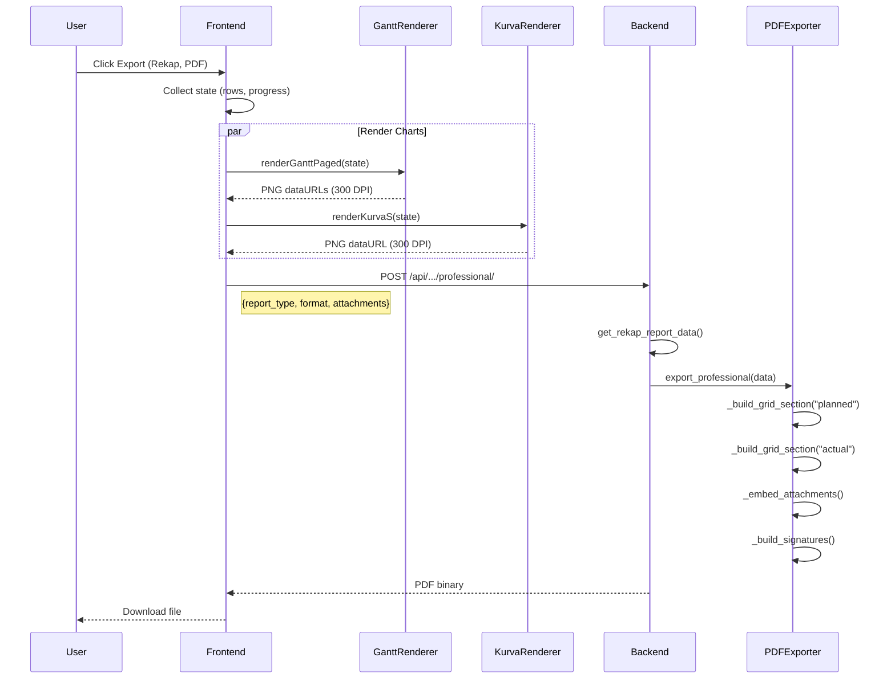

# Walkthrough: Implementasi Export Laporan Rekapitulasi (PDF/Word)

Dokumen ini menjelaskan langkah-langkah untuk memastikan export Laporan Rekapitulasi menghasilkan output sesuai ekspektasi.

---

## Target Output

```
┌───────────────────────────────────────────────────┐
│ HALAMAN 1-N: GRID RENCANA (PLANNED)               │
│ - Header: Info proyek                             │
│ - Tabel hierarchical dengan kolom mingguan        │
│ - Total per minggu + kumulatif                    │
├───────────────────────────────────────────────────┤
│ HALAMAN N+1-M: GRID REALISASI (ACTUAL)            │
│ - Struktur sama, data aktual                      │
├───────────────────────────────────────────────────┤
│ HALAMAN LAMPIRAN: KURVA S                         │
│ - Chart image (Planned vs Actual)                 │
├───────────────────────────────────────────────────┤
│ HALAMAN LAMPIRAN: GANTT CHART                     │
│ - Chart image (Labels + Timeline + Bars)          │
├───────────────────────────────────────────────────┤
│ HALAMAN TERAKHIR: LEMBAR PENGESAHAN               │
└───────────────────────────────────────────────────┘
```

---

## Flow Diagram



---

## Langkah Implementasi

### Step 1: Verifikasi Data Adapter

**File**: `detail_project/exports/jadwal_pekerjaan_adapter.py`

**Method yang digunakan**: `get_rekap_report_data()`

```python
def get_rekap_report_data(self) -> Dict[str, Any]:
    """
    Generate data struktur untuk Laporan Rekapitulasi
    
    Returns:
        {
            'planned_pages': [...],   # Grid pages untuk Rencana
            'actual_pages': [...],    # Grid pages untuk Realisasi
            'kurva_s_data': [...],    # Data untuk chart
            'project_summary': {...}, # Info ringkasan
        }
    """
```

**Checklist Verifikasi**:
- [ ] Method exists dan returns correct structure
- [ ] `planned_pages` berisi data progress RENCANA
- [ ] `actual_pages` berisi data progress REALISASI (dari tabel berbeda)
- [ ] Pagination columns/rows bekerja dengan benar
- [ ] Hierarchy (Klasifikasi → Sub → Pekerjaan) preserved

---

### Step 2: Verifikasi PDF Exporter

**File**: `detail_project/exports/pdf_exporter.py`

**Method utama**: `export_professional()`

**Struktur yang harus di-generate**:

```python
def export_professional(self, data: Dict[str, Any], attachments: List = None) -> HttpResponse:
    story = []
    
    # 1. GRID RENCANA
    for page in data.get('planned_pages', []):
        story.extend(self._build_grid_page(page, title="Progress Rencana"))
        story.append(PageBreak())
    
    # 2. GRID REALISASI
    for page in data.get('actual_pages', []):
        story.extend(self._build_grid_page(page, title="Progress Realisasi"))
        story.append(PageBreak())
    
    # 3. KURVA S (from attachment)
    if kurva_attachment:
        story.extend(self._build_chart_page(kurva_attachment, "Kurva S"))
        story.append(PageBreak())
    
    # 4. GANTT (from attachments)
    for gantt_page in gantt_attachments:
        story.extend(self._build_chart_page(gantt_page, gantt_page['title']))
        story.append(PageBreak())
    
    # 5. LEMBAR PENGESAHAN
    story.extend(self._build_signatures())
    
    # Build PDF
    doc.build(story)
    return response
```

**Checklist Verifikasi**:
- [ ] Grid Rencana dan Realisasi TERPISAH (bukan merged)
- [ ] Setiap grid page memiliki header info proyek
- [ ] Chart attachments di-embed sebagai Image
- [ ] Lembar pengesahan ada di akhir

---

### Step 3: Verifikasi Frontend Export Flow

**File**: `detail_project/static/detail_project/js/src/jadwal_kegiatan_app.js`

**Method**: `handleExport()`

**Data yang harus dikirim ke backend**:

```javascript
const payload = {
  report_type: 'rekap',
  format: 'pdf',  // atau 'word'
  period: null,   // null untuk rekap (full timeline)
  attachments: [
    // Kurva S
    {
      title: 'Kurva S Weekly',
      data_url: 'data:image/png;base64,...',
      format: 'png'
    },
    // Gantt pages (bisa multiple)
    {
      title: 'Gantt W1-W12',
      data_url: 'data:image/png;base64,...',
      format: 'png'
    },
    {
      title: 'Gantt W13-W24',
      data_url: 'data:image/png;base64,...',
      format: 'png'
    }
  ]
};
```

**Checklist Verifikasi**:
- [ ] Charts di-render SEBELUM API call
- [ ] Kurva S menggunakan `renderKurvaS()` dengan DPI 300
- [ ] Gantt menggunakan `renderGanttPaged()` dengan DPI 300
- [ ] Attachments dikirim sebagai base64 PNG

---

### Step 4: Verifikasi Grid Table Structure

**Ekspektasi tabel**:

```
┌─────┬────────────────────┬───────┬────────┬────────┬────────┬─────────┐
│ No  │ Uraian             │ Bobot │   W1   │   W2   │   W3   │  Total  │
├─────┼────────────────────┼───────┼────────┼────────┼────────┼─────────┤
│     │ KLASIFIKASI A      │       │        │        │        │         │ ← Bold, BG color
│ 1   │  Sub A.1           │       │        │        │        │         │ ← Bold
│ 1.1 │   Pekerjaan 1      │ 15%   │  5%    │  10%   │  5%    │   20%   │ ← Normal
│ 1.2 │   Pekerjaan 2      │ 20%   │        │  8%    │  12%   │   20%   │
├─────┼────────────────────┼───────┼────────┼────────┼────────┼─────────┤
│     │ TOTAL PROGRESS     │       │  5%    │  18%   │  17%   │   40%   │ ← Bold
│     │ KUMULATIF          │       │  5%    │  23%   │  40%   │         │
└─────┴────────────────────┴───────┴────────┴────────┴────────┴─────────┘
```

**Checklist Verifikasi**:
- [ ] Kolom "No" dengan numbering hierarchical (1, 1.1, 1.1.1)
- [ ] Kolom "Uraian" dengan indentasi visual
- [ ] Kolom "Bobot" (weight percentage)
- [ ] Kolom mingguan (W1, W2, ...)
- [ ] Kolom "Total" (row total)
- [ ] Baris "TOTAL PROGRESS" per column
- [ ] Baris "KUMULATIF" running total

---

### Step 5: Test Manual

1. **Buka halaman Jadwal Pekerjaan**
   ```
   http://127.0.0.1:8000/detail_project/{project_id}/jadwal-pekerjaan/
   ```

2. **Input beberapa data progress** (jika belum ada)
   - Mode Rencana: Input di beberapa minggu
   - Mode Realisasi: Input di beberapa minggu

3. **Klik Export → Pilih Rekap Laporan → PDF**

4. **Aktifkan toggle "Laporan Tertulis Profesional"**

5. **Klik "Export Sekarang"**

6. **Verifikasi hasil PDF**:
   - [ ] Halaman 1+: Grid Rencana (dengan data yang diinput)
   - [ ] Halaman N+: Grid Realisasi (dengan data yang diinput)
   - [ ] Halaman lampiran: Kurva S chart
   - [ ] Halaman lampiran: Gantt chart (dengan labels + bars)
   - [ ] Halaman terakhir: Lembar Pengesahan

---

## Troubleshooting

### Issue: Grid kosong / tidak ada data

**Penyebab**: Data progress belum disimpan atau method adapter tidak membaca dengan benar.

**Solusi**:
```python
# Di jadwal_pekerjaan_adapter.py, debug:
def get_rekap_report_data(self):
    logger.info(f"Building rekap data for project {self.project.id}")
    
    planned_data = self._build_section_pages(mode='planned')
    logger.info(f"Planned pages: {len(planned_data)}")
    
    actual_data = self._build_section_pages(mode='actual')
    logger.info(f"Actual pages: {len(actual_data)}")
    
    return {...}
```

### Issue: Gantt chart tidak muncul

**Penyebab**: Attachments tidak dikirim atau format salah.

**Solusi**:
```javascript
// Di handleExport(), debug:
console.log('Attachments to send:', attachments);
console.log('Gantt pages count:', ganttPages.length);
```

### Issue: Chart buram / low quality

**Penyebab**: DPI tidak di-set 300.

**Solusi**:
```javascript
// Pastikan di renderKurvaS dan renderGanttPaged:
const result = await renderKurvaS({
  ...,
  dpi: 300  // ← Wajib 300 untuk print
});
```

---

## Verification Checklist

### Sebelum Test

- [ ] Server Django running (`python manage.py runserver`)
- [ ] Vite dev server running (jika development)
- [ ] Project memiliki data Jadwal Pekerjaan
- [ ] Data progress sudah diinput (Rencana + Realisasi)

### Setelah Export

| Komponen | PDF | Word |
|----------|-----|------|
| Grid Rencana (multi-page) | ⬜ | ⬜ |
| Grid Realisasi (multi-page) | ⬜ | ⬜ |
| Kurva S Chart | ⬜ | ⬜ |
| Gantt Chart (integrated) | ⬜ | ⬜ |
| Lembar Pengesahan | ⬜ | ⬜ |
| Hierarchy styling | ⬜ | ⬜ |
| Print quality (300 DPI) | ⬜ | ⬜ |

---

## Files Modified/Created

| File | Status | Purpose |
|------|--------|---------|
| `jadwal_pekerjaan_adapter.py` | Modified | `get_rekap_report_data()` |
| `pdf_exporter.py` | Modified | `export_professional()` |
| `word_exporter.py` | TODO | `export_professional()` |
| `export_manager.py` | Modified | `export_jadwal_professional()` |
| `views_api.py` | Modified | Endpoint `/professional/` |
| `jadwal_kegiatan_app.js` | Modified | `handleExport()` |
| `kelola_tahapan_grid_modern.html` | Modified | Professional toggle UI |

---

## Next Steps

1. ✅ Laporan Rekapitulasi PDF — verify
2. ⬜ Laporan Rekapitulasi Word — implement `word_exporter.export_professional()`
3. ⬜ Laporan Bulanan PDF/Word
4. ⬜ Laporan Mingguan PDF/Word
5. ⬜ XLSX exports
6. ⬜ CSV exports
