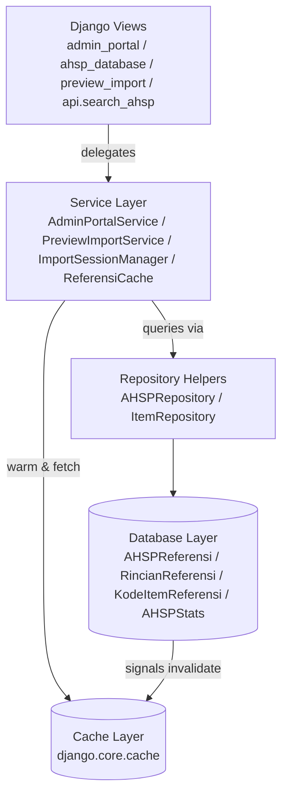

# Architecture Overview

## Key Flows

- **Admin Portal**: Views call `AdminPortalService`, which composes querysets through repositories. Cached dropdown data is served via `ReferensiCache`; form submissions persist using model formsets.
- **Preview Import**: Excel uploads are parsed into `ParseResult` structures, persisted temporarily via `ImportSessionManager`. When committed, `write_parse_result_to_db` writes canonical models and refreshes statistics.
- **API Search**: Lightweight lookup against `AHSPReferensi` that respects configurable limits and returns Select2-compatible payloads.

## Observability Hooks

- Cache warmer (`ReferensiCache.warm_cache`) primes dropdown data after deploys.
- Signals (`referensi.signals`) invalidate caches whenever AHSP or rincian records change.
- `django-simple-history` tracks all modifications to AHSP, rincian, and kode item models for audit purposes.
