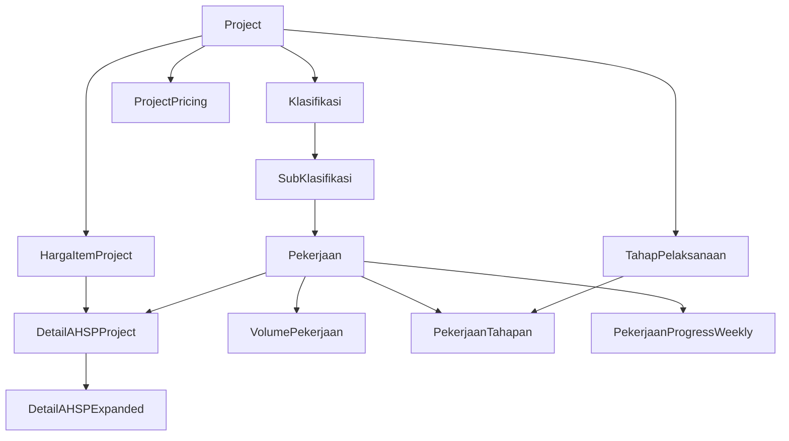

# Project Export/Import Feature - Implementation Plan

## Overview

Fitur untuk export seluruh Project ke JSON dan import ke user lain.  
Dual-purpose: User sharing + Test fixtures.

---

## Data Dependency Graph



---

## Phase 1: Core Data Export (Foundation)

> **Goal**: Export data dasar yang merupakan input user langsung

### 1.1 Dashboard - Project
| Field | Export? | Notes |
|-------|---------|-------|
| `nama`, `sumber_dana`, `lokasi_project` | ✅ | Identitas |
| `nama_client`, `anggaran_owner` | ✅ | Info client |
| `tanggal_mulai`, `tanggal_selesai` | ✅ | Timeline |
| `week_start_day`, `week_end_day` | ✅ | Config |
| `owner`, `index_project` | ❌ | Per-user, auto-generated |

### 1.2 Harga Items (HargaItemProject)  
| Field | Export? |
|-------|---------|
| `kategori`, `kode_item`, `uraian`, `satuan`, `harga_satuan` | ✅ |

### 1.3 List Pekerjaan
| Model | Fields |
|-------|--------|
| `Klasifikasi` | `name`, `ordering_index` |
| `SubKlasifikasi` | `name`, `ordering_index` |
| `Pekerjaan` | `source_type`, `snapshot_kode/uraian/satuan`, `ordering_index`, `ref_*` (for reference type) |

---

## Phase 2: Volume & Pricing

> **Goal**: Export data volume dan pricing

### 2.1 Volume Pekerjaan
| Field | Notes |
|-------|-------|
| `pekerjaan` (FK) | Reference by natural key (kode) |
| `quantity` | Decimal |

### 2.2 Project Pricing  
| Field | Notes |
|-------|-------|
| `markup_percent`, `ppn_percent` | Decimal |

---

## Phase 3: AHSP Details

> **Goal**: Export rincian AHSP per pekerjaan

### 3.1 DetailAHSPProject (Rincian AHSP)
| Field | Export? |
|-------|---------|
| `pekerjaan` (FK) | ✅ by natural key |
| `harga_item` (FK) | ✅ by kode_item |
| `kategori`, `kode`, `uraian`, `satuan` | ✅ |
| `koefisien`, `is_override` | ✅ |

### 3.2 DetailAHSPExpanded  
| Export? | Notes |
|---------|-------|
| ❌ SKIP | Auto-generated dari DetailAHSPProject |

---

## Phase 4: Scheduling (Jadwal Pekerjaan)

> **Goal**: Export jadwal dan progress

### 4.1 TahapPelaksanaan (Tahapan)
| Field | Export? |
|-------|---------|
| `nama`, `urutan` | ✅ |
| `tanggal_mulai`, `tanggal_selesai` | ✅ |

### 4.2 PekerjaanTahapan (Assignment)
| Field | Export? |
|-------|---------|
| `pekerjaan`, `tahapan` | ✅ by natural key |
| `proporsi_volume` | ✅ |

### 4.3 PekerjaanProgressWeekly (Progress)
| Field | Export? |
|-------|---------|
| `pekerjaan`, `week_number` | ✅ |
| `planned_proportion`, `actual_proportion` | ✅ |
| `week_start_date`, `week_end_date` | ✅ |

---

## Phase 5: Rekap (Read-Only - No Export Needed)

| Page | Export? | Reason |
|------|---------|--------|
| Rekap RAB | ❌ | Computed from above data |
| Rekap Kebutuhan | ❌ | Computed from above data |

---

## Export Order (untuk Import)

```
1. Project (root)
2. HargaItemProject (no FK besides project)
3. Klasifikasi → SubKlasifikasi → Pekerjaan (hierarchy)
4. VolumePekerjaan (needs Pekerjaan)
5. DetailAHSPProject (needs Pekerjaan + HargaItem)
6. TahapPelaksanaan (needs Project)
7. PekerjaanTahapan (needs Pekerjaan + Tahap)
8. PekerjaanProgressWeekly (needs Pekerjaan)
9. ProjectPricing (needs Project)
```

---

## JSON Format (Proposed)

```json
{
  "format_version": "1.0",
  "exported_at": "2026-01-03T12:30:00Z",
  "project": {
    "nama": "...",
    "sumber_dana": "...",
    ...
  },
  "harga_items": [...],
  "struktur_pekerjaan": {
    "klasifikasi": [
      {
        "name": "Pekerjaan Persiapan",
        "sub_klasifikasi": [
          {
            "name": "Pembersihan",
            "pekerjaan": [...]
          }
        ]
      }
    ]
  },
  "volumes": [...],
  "detail_ahsp": [...],
  "tahapan": [...],
  "pekerjaan_tahapan": [...],
  "weekly_progress": [...],
  "pricing": {...}
}
```

---

## Implementation Checklist

### Phase 1: Core Export
- [ ] Export endpoint: `/api/project/<id>/export/json/`
- [ ] Export Project metadata
- [ ] Export HargaItemProject
- [ ] Export Klasifikasi hierarchy with Pekerjaan

### Phase 2: Volume & Pricing
- [ ] Export VolumePekerjaan  
- [ ] Export ProjectPricing

### Phase 3: AHSP
- [ ] Export DetailAHSPProject

### Phase 4: Scheduling
- [ ] Export TahapPelaksanaan
- [ ] Export PekerjaanTahapan
- [ ] Export PekerjaanProgressWeekly

### Phase 5: Import
- [ ] Import endpoint: `/api/project/import/`
- [ ] Validate JSON format
- [ ] ID remapping for new project
- [ ] Handle FK references by natural key
- [ ] Conflict resolution strategy

### Phase 6: UI
- [ ] Dashboard: Export button per project
- [ ] Dashboard: Import modal
- [ ] Progress indicator for large projects
