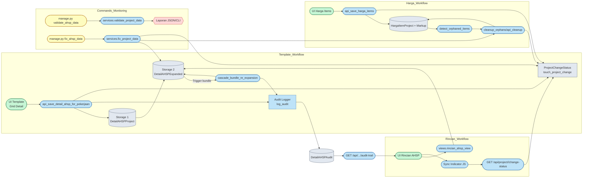
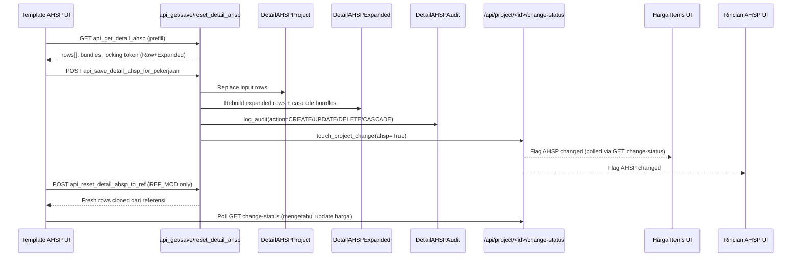
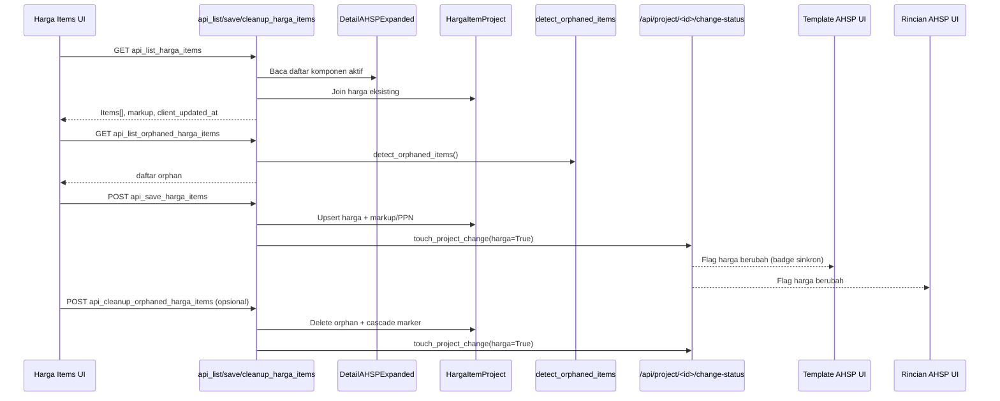
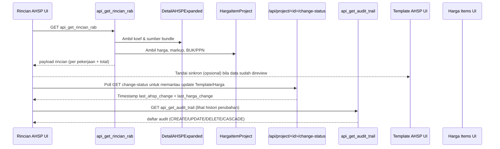
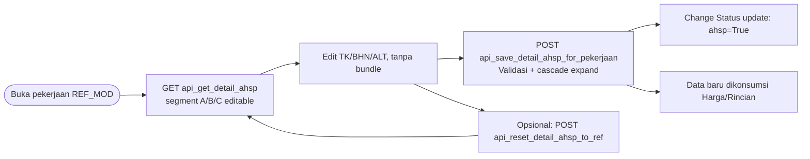

# AHSP Workflow Data Flow Overview

Dokumen ini merangkum alur kerja end-to-end setelah implementasi Fase 0-4. Gunakan sebagai referensi cepat untuk memahami sumber input, proses yang terjadi, serta output/artefak yang dihasilkan.

## Diagram Alur Terpadu

Diagram berikut memetakan hubungan utama antar sumber input, layanan backend, penyimpanan data, serta artefak monitoring/audit. Setiap kotak hijau adalah titik interaksi UI/API, biru untuk layanan backend, abu-abu untuk storage/data tracker, dan oranye untuk artefak laporan.



## Diagram Interaksi Per Halaman

### Template AHSP Page

Template page menerima data struktur pekerjaan melalui `api_get_detail_ahsp`, menulis ulang storage via `api_save_detail_ahsp_for_pekerjaan`, dan (khusus REF_MOD) bisa melakukan reset ke referensi melalui `api_reset_detail_ahsp_to_ref`. Perubahan yang dilakukan menghasilkan sinyal ke halaman Harga maupun Rincian melalui Change Status API.



### Harga Items Page

Harga page hanya menerima daftar item yang sudah diexpand oleh Template. Ia memuat data via `api_list_harga_items`, menyimpan nilai melalui `api_save_harga_items`, serta menangani orphan melalui `api_list_orphaned_harga_items` dan `api_cleanup_orphaned_harga_items`. Setiap penyimpanan atau cleanup memberi sinyal perubahan ke Template/Rincian agar mereka bisa me-refresh data harga.



### Rincian AHSP Page

Rincian page merangkum output Template + Harga. Ia memanggil `api_get_rincian_rab` untuk mengambil kombinasi koefisien & harga, menampilkan status sinkron lewat `api_get_change_status`, dan dapat membuka audit trail melalui `api_get_audit_trail`.


## 1. Template AHSP Workflow

| Tahap | Input | Proses | Output |
|-------|-------|--------|--------|
| 1. UI/API submit detail pekerjaan | Payload `rows[]` (kategori, kode, uraian, satuan, koef, ref_kind/ref_id) | `views_api.api_save_detail_ahsp_for_pekerjaan`
- Validasi kategori/duplikat, bundle ref
- Audit snapshot lama (`snapshot_pekerjaan_details`)
- Tulis Storage 1 (`DetailAHSPProject`)
- Populate Storage 2 (`DetailAHSPExpanded`)
- Cascade re-expansion jika bundle terkait
- Logging audit (`log_audit` action CREATE/UPDATE/DELETE)
- Update change tracker (`touch_project_change(ahsp=True)` + `detail_last_modified`) | - Storage 1 & 2 sinkron
- Audit entry per perubahan
- `ProjectChangeStatus.last_ahsp_change`
- Cascade results untuk pekerjaan lain |
| 2. Cascade (otomatis) | Trigger dari step 1 | `services.cascade_bundle_re_expansion`
- Re-expand pekerjaan yang mereferensi target
- Logging metrics & audit CASCADE
- Update `detail_last_modified` pekerjaan terdampak | - Storage 2 terbarui untuk chain bundle
- Audit action CASCADE |

## 2. Harga Items Workflow

| Tahap | Input | Proses | Output |
|-------|-------|--------|--------|
| 1. UI/API submit harga + markup | Payload `items[]`, `markup_percent`, `client_updated_at` | `views_api.api_save_harga_items`
- Validasi numeric/duplikat
- Update `HargaItemProject`
- Simpan markup/PPN
- Trigger change tracker (`touch_project_change(harga=True)`) | - Harga terkini
- Profit/Margin terkini
- `ProjectChangeStatus.last_harga_change` |
| 2. Orphan detection | - | `services.detect_orphaned_items()` (dipakai UI, command, validation) | Daftar orphan (id, kode, metadata) |
| 3. Orphan cleanup | Pilihan item (UI) atau parameter command | - UI `api_cleanup_orphaned_harga_items`
- Command `cleanup_orphans` (dry-run/limit)
- Fase 4 `fix_ahsp_data` dapat memanggil cleanup | - Item orphan dihapus
- `touch_project_change(harga=True)` bila ada yang hilang |

## 3. Rincian AHSP Workflow

| Tahap | Input | Proses | Output |
|-------|-------|--------|--------|
| 1. Rendering | Project ID | `views.rincian_ahsp_view`
- Menyediakan data Storage 2
- Menyertakan `ProjectChangeStatus` untuk badge sinkron | Halaman Rincian AHSP dengan data expand |
| 2. Sink indicator polling | - | Komponen `_sync_indicator.html` + `sync_indicator.js`
- Poll `GET /api/project/<id>/change-status/`
- Bandingkan timestamp AHSP/Harga/Pekerjaan
- Badge + tombol "Tandai sinkron"
- Opsional toggle auto refresh (Rincian) | Notifikasi perubahan lintas halaman; auto-reload jika diaktifkan |

## 4. Change Status API

`GET /api/project/<id>/change-status/`
- Query parameters (opsional): `since_ahsp`, `since_harga`, `pekerjaan_since`
- Response: `ahsp_changed_at`, `harga_changed_at`, `affected_pekerjaan_count`, `recent_pekerjaan[]`
- Di-backend memakai `ProjectChangeStatus` + `Pekerjaan.detail_last_modified`.

## 5. Audit Trail

| Sumber | Proses | Output |
|--------|--------|--------|
| Template save/reset | `log_audit` menulis `DetailAHSPAudit` (snapshot lama/baru, summary) | Riwayat CREATE/UPDATE/DELETE |
| Cascade re-expansion | `log_audit` action CASCADE (`triggered_by='cascade'`) | Entry CASCADE + ringkasan chain |
| UI audit trail | `GET /api/project/<id>/audit-trail/` + halaman `audit_trail.html` (filter, diff) | Timeline perubahan |

## 6. Validation & Migration Tools

| Command | Input | Proses | Output |
|---------|-------|--------|--------|
| `python manage.py validate_ahsp_data` | `--project-id` atau `--all-projects`, `--orphan-threshold`, `--output=report.json` | Memanggil `services.validate_project_data`
- Identifikasi bundle invalid, circular, mismatch expansion, orphan | Laporan per project (CLI + opsi JSON) |
| `python manage.py fix_ahsp_data` | `--project-id/--all-projects`, `--dry-run`, `--no-reexpand`, `--no-cleanup`, `--older-than-days`, `--limit` | Memanggil `services.fix_project_data`
- Re-expand Storage 2
- Cleanup orphans (reusing helper Fase?1)
- Update change tracker | Ringkasan aksi (CLI), Storage 2 kembali sinkron |

## 7. Referensi Dokumen

- `detail_project/WORKFLOW_3_PAGES.md` - narasi lengkap alur Template ? Harga ? Rincian.
- `docs/DUAL_STORAGE_ARCHITECTURE.md` - struktur storage ganda & dependensi.
- `detail_project/IMPLEMENTATION_ROADMAP.md` - status & catatan detail per fase.
- `detail_project/tests/test_*` - contoh penggunaan helper/command.

## Alur Per Jenis Sumber Pekerjaan (`source_type`)

### 1. Referensi (`source_type = ref`)

```mermaid
flowchart LR
    REF_START([Pilih pekerjaan Referensi]) --> REF_VIEW[GET api_get_detail_ahsp<br/>Mode: read-only]
    REF_VIEW --> REF_ROUTES{Aksi lanjut?}
    REF_ROUTES -->|Lihat harga / export| RINCIAN[Halaman Rincian (GET api_get_rincian_rab)]
    REF_ROUTES -->|Butuh modifikasi?| CLONE[Clone jadi REF_MOD melalui UI Rincian Gabungan]
    REF_ROUTES -->|Tetap referensi| DONE_REF([Tidak ada penulisan data])
```

Karena read-only, Template page hanya memuat data; perubahan dilakukan dengan menyalin ke jenis lain.

### 2. Referensi Modifikasi (`source_type = ref_modified`)



Fitur bundle dan segment D tetap terkunci; alur fokus pada menjaga kesesuaian dengan referensi sambil mencatat audit dan change tracker.

> Catatan: per 2025-11-14, saat pekerjaan berpindah dari REF ke REF_MODIFIED seluruh detail referensi dipindahkan ke pekerjaan lama dan storage expand (`DetailAHSPExpanded`) langsung dibangun ulang. Dengan begitu daftar Harga Items dan halaman Rincian tidak lagi kosong setelah pergantian sumber.

### 3. Custom (`source_type = custom`)

```mermaid
flowchart LR
    C_START([Buka pekerjaan CUSTOM]) --> C_GET[GET api_get_detail_ahsp<br/>Semua segment editable]
    C_GET --> C_EDIT[Tambah/edit TK/BHN/ALT/LAIN termasuk bundle]
    C_EDIT --> C_SAVE[POST api_save_detail_ahsp_for_pekerjaan]
    C_SAVE --> C_EXPAND[Rebuild DetailAHSPExpanded + cascade bundle]
    C_SAVE --> C_AUDIT[Audit log + Change Status ahsp=True]
    C_EXPAND --> HARGA[Harga Items GET api_list_harga_items (items baru?)]
    HARGA --> RINCIAN[Harga + koef digunakan di Rincian]
```

Jenis CUSTOM memiliki alur paling lengkap: bisa menjadi sumber bundle untuk pekerjaan lain, memicu penambahan item harga baru, dan seluruh perubahan tercermin di halaman Harga serta Rincian.

---
_Diperbarui: 2025-11-14_
